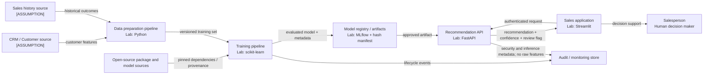

# Reference Architecture

The diagram is an **[ASSUMPTION] reference architecture**, not a statement about a real company. Replace nodes and flows after discovery.

## Design intent

- The AI provides decision support; the salesperson remains accountable for the offer.
- Training and inference are separated so model change requires an explicit promotion path.
- Model artifacts are verified before loading; production should replace the lab hash with signed provenance.
- Logs record who/what/when and outcome metadata while minimizing customer feature content.
- External dependencies cross a supply-chain trust boundary and require provenance, scanning, and approval.

## Deployment views

- **Laboratory:** all components run locally or through Docker Compose with synthetic data.
- **Production:** [OPEN QUESTION] cloud/on-premise topology, zones, services, high availability, and inherited controls are unknown.
