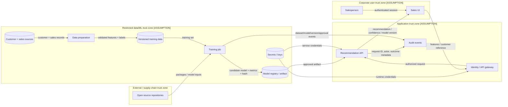

# Security Data-Flow Diagram

## Flow inventory

| Flow | Data | Trust boundary | Required properties | Production evidence |
|---|---|---|---|---|
| DF-01 | Customer and sales records | Source → restricted ML | Purpose limitation, minimization, integrity, encryption | Data contract, lineage, DLP and access logs |
| DF-02 | OSS packages/model input | Internet → build | Provenance, pinning, review, scanning, isolation | Lockfile, SBOM, signatures/attestations, CI logs |
| DF-03 | Training set | Prep → training | Versioning, validation, authorization | Dataset digest, schema test, approval |
| DF-04 | Model artifact | Registry → inference | Approval, integrity, authenticity, rollback | Registry ACL, signature/hash, deployment record |
| DF-05 | Inference request | Corporate → application | Authentication, authorization, validation, rate limit | Gateway/IAM config and test |
| DF-06 | Recommendation | API → sales UI | Integrity, explanation, version, human review | UI test, decision log, model card |
| DF-07 | Audit event | Components → logging | Integrity, time sync, minimization, retention | Log schema, access/retention settings, alerts |

## STRIDE focus

- **Spoofing:** stolen salesperson/service credentials.
- **Tampering:** poisoned data, changed model, manipulated request or dependency.
- **Repudiation:** missing model, user, decision, and override audit trail.
- **Information disclosure:** customer features, logs, model inversion/extraction.
- **Denial of service:** inference flooding, dependency or registry outage.
- **Elevation of privilege:** build/runtime credential misuse and excessive admin access.
