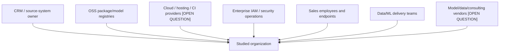

# Workshop 3 — Strategic Scenarios

## Ecosystem map

## Dependency assessment

| Ecosystem party | Dependency | Exposure/weakness to validate | Security objective |
|---|---|---|---|
| Source-system owner | Accurate, authorized customer/sales data | Excess access, poor labels, undocumented changes | Data contract, lineage, quality and access review |
| OSS registries/maintainers | Authentic packages/models and advisories | Account takeover, typosquat, malicious update, abandoned component | Pin, verify provenance, scan, approve and monitor |
| Hosting/CI provider | Isolated execution, availability, evidence | Misconfiguration, token theft, regional outage | Hardened build/runtime, short-lived identity, recovery |
| Enterprise IAM/SOC | Identity assurance and response | Excess privilege, alert gaps | MFA, least privilege, monitoring and incident linkage |
| Sales workforce/endpoints | Correct use and protected sessions | Phishing, misuse, shadow exports, overreliance | Training, endpoint controls, human-oversight UX |
| Data/ML teams | Correct data/model lifecycle | Error, unauthorized change, conflicts of duty | Review, separation, validation, approval, audit |

## Strategic scenarios

| ID | Risk source → ecosystem path → target → feared event | Linked pair | Priority rationale |
|---|---|---|---|
| SS-01 | Cybercriminal → compromised user/service identity → application/API → customer information → FE-01 | RSO-01 | Common access path with potentially severe data impact. |
| SS-02 | Supply-chain attacker → OSS registry/dependency → CI/training environment → credentials/data/model → FE-01/02/03 | RSO-02 | Open-source reliance creates a necessary external dependency. |
| SS-03 | Insider/process failure → source/data pipeline → training data → model behavior → FE-02/03/06 | RSO-03/06 | Integrity failures can scale silently through retraining. |
| SS-04 | Malicious admin → registry/deployment path → inference model → recommendations → FE-03/07 | RSO-03 | Privileged access can bypass normal user controls. |
| SS-05 | Competitor/abuser → valid inference access → repeated queries → model/commercial intelligence → FE-05 | RSO-04/05 | Predictive interfaces may leak behavior without traditional compromise. |
| SS-06 | External abuser/failure → API/platform/dependency → service capacity → FE-04 | RSO-01/05/06 | Availability and fallback needs are unknown. |
| SS-07 | Lifecycle failure → unrepresentative data/unchecked drift → recommendations/customer treatment → FE-06 | RSO-06 | AI harm can emerge without a malicious attacker. |
| SS-08 | Operations/process failure → over-collection or sensitive logs → unauthorized readers → FE-01/07 | RSO-03/06 | Observability can create a secondary sensitive dataset. |

## Ecosystem measures

- Contractual security/data requirements and evidence rights for material suppliers.
- Trusted registry allowlist, pinned versions, provenance verification, SBOM and vulnerability/license response.
- Short-lived workload identity, isolated runners, protected branches/environments and two-person promotion.
- Data contracts, schema/quality monitoring and change notification with accountable source owners.
- Joiner/mover/leaver and privileged-access reviews across internal and third-party users.
